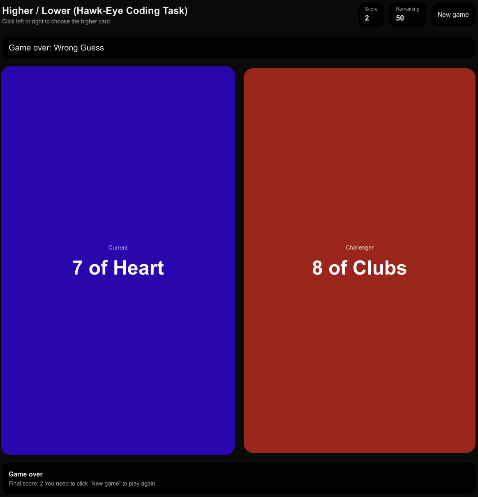
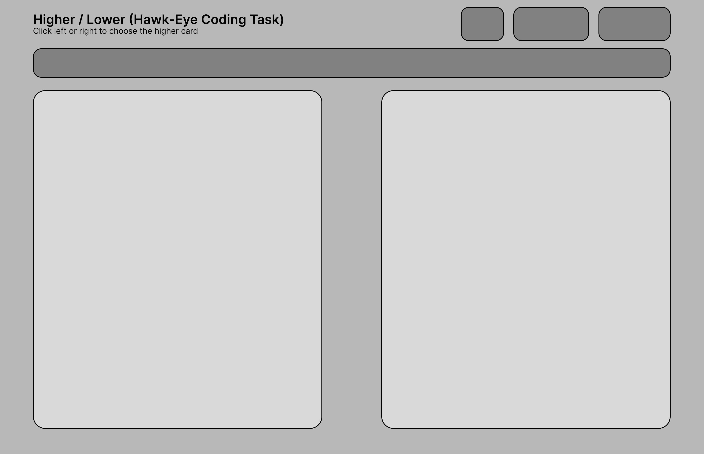

# Higher / Lower Card Game
### Hawk-Eye Innovations – Graduate Software Engineering Coding Task


## Overview

This project is an implementation of a card game inspired by Higher / Lower, built as part of the Hawk-Eye Innovations Graduate Software Engineering application process.

**The project demonstrates**:

- Clean modelling of a standard playing card deck
- A defined game engine with clear rules
- A playable CLI-based UI
- An extended GUI-based UI built with modern web technologies
- Focusing on extensibility (such as Jokers and GUI)

The same core game logic is shared across both the CLI and GUI, highlighting separation of concerns and maintainable architecture.

**Checklist of requierement**:

**Requirements**:
- [x] Model a standard 52 card deck - current implementation includes 2 extra cards for the Jokers
- [x] Implement some mechanism for shuffling the deck - Utilises  Fisher–Yates algorithim
- [x] Create rule(s) for the game - Rules are shown in this README
- [x] Build a simple CLI based UI to play it - CLI created by running `npm run cli`
**Possible Extensions**:
- [x] Add 2 Jokers to deck
- [x] Add a GUI based UI - Built using Next.js
- [ ] Add an alternative “game”


## Game Rules (Rolling Higher / Lower)
- The deck is shuffled at the start of each game.
- Two cards are visible at all times:
    - Current card
    - Challenging card
- The player decides whether the challenger card is higher or lower than the current card.
- If the guess is correct:
    - The score increases by 1
    - The challenger card becomes the new current card
    - A new challenger card is drawn
- If the guess is incorrect, the game ends.
- Tie rule:
    - If both cards have the same rank, the guess is considered correct.
- The game will end if the deck runs out of cards.

Card comparison is based on rank only:

`2 < 3 < 4 < 5 < 6 < 7 < 8 < 9 < 10 < J < Q < K < A < Joker`


## Jokers Extension
As an extension, the deck includes two Jokers:
- Jokers have a higher value than an Ace.
- Joker vs Joker is a tie, which counts as a correct guess.
- Jokers integrate seamlessly with existing comparison logic.

This extension demonstrates how the core engine can be evolved without disrupting existing functionality.

## Project Structure
```
/src
  card.ts       // Card, Suit and Rank
  deck.ts       // Deck creation, shuffle with the utilisation of Fisher–Yates algorithim, draw logic
  game.ts       // Core game rules and state management
  cli.ts      // CLI-based user interface

/web/src
  app/          // Next.js GUI application using Tailwind CSS
```
Both the CLI and GUI import and reuse the same engine logic.

## CLI Version
### Features
- Fully playable in the terminal
- Displays current and challenging cards
- Accepts user input: `(h / l / q)`
- Shows scoring.

### Running the CLI
From the project root:
```bash
npm install
npm start
```

## GUI Extension Version
### Features
- Built with Next.js and Tailwind CSS
- Two large cards displayed side-by-side
- Player clicks the left or right card to choose which is higher
- Live score and remaining card count
- Game-over state and restart option
- Designed to mirror the CLI gameplay visually

### Running the GUI
```
cd web
npm install
npm run dev
```

Then open:

`http://localhost:3000`

## Screenshots
The following screenshots demonstrate the GUI-based version of the game, highlighting the split-screen card layout, scoring system, and interaction model.

### Main Gameplay Screen
- Two large cards displayed side-by-side
- Player selects the higher card by clicking left or right
- Score and remaining card count displayed at the top
---


### Game Over Screen
- Text is shown below to inform the user that the game has ended.
---


### Initial Wireframing Screen
- A base wireframe was created on Figma to provide an initial design of the User Interface.
---



## Demo Video (15 Seconds)

A short demo video is included to showcase the core gameplay loop and user interaction.

The clip demonstrates:
- Game-over state and restart flow
- Selecting the higher card via the GUI
- Score increment on correct guesses
- Demo length: 15 seconds
**15-second demo video:** [Link](https://github.com/SamsonOlajide/hawk-eye_project/raw/refs/heads/main/demo/demo.mp4)


## Design Decisions
- Separation of concerns
    - Game rules are isolated from UI logic, making the engine reusable and testable.

- Rolling comparison mechanic
    - Keeping the challenger card as the next current card creates a smooth, intuitive flow and reduces any randomness.

- Fisher–Yates shuffle
    - Ensures an unbiased and realistic shuffle of the deck.

- TypeScript strictness
    - Defensive checks and strict typing were used to prevent invalid states (for instance drawing from an empty deck).

- Tailwind CSS
    - Chosen for rapid iteration and responsive UI styling.

## Possible Future Improvements

- Difficulty scaling (e.g. time-limited decisions)
- Animations for card transitions on the UI
- Leaderboards or persistent high scores using a database
- Additional game modes
- Accessibility improvements such as keyboard-only mode.

## Conclusion

This project demonstrates a practical and maintainable approach to software design, combining backend-style logic with frontend interaction. It was built with clarity and user experience in mind.

Thank you for taking the time to review this submission.
